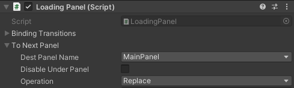

# EasyUI
通过堆栈的方式管理`UGui`界面层级、跳转/过度和生命周期。

## 安装
项目依赖`UniRx`（提供事件）和`UniTask`（处理异步），
需要在manifest.json中加入openupm的scope，
对两者进行加载。

*将以下json加入manifest.json中进行安装*
```json
{
    "dependencies": {
        "com.hpcfun.easyui": "1.0.6"
    },
    "scopedRegistries": [
        {
            "name": "package.openupm.com",
            "url": "https://package.openupm.com",
            "scopes": [
                "com.cysharp.unitask",
                "com.neuecc.unirx",
                "com.openupm"
            ]
        },
        {
            "name": "hpcfun.com",
            "url": "https://verdaccio.hpcfun.com",
            "scopes": [
                "com.hpcfun"
            ]
        }
    ]
}
```

## 基本用法
1.  添加UIStack

    在根部Canvas所在GameObject上添加UIStack脚本。

2.  创建PanelFactory

    UIStack通过PanelFactory进行界面的创建和回收。
    PanelFactory是个抽象类，
    继承自ScriptableObject，
    没有实现代码，
    需要用户自定义界面创建和回收的方式，
    以提供更大的灵活性（*方便通过AssetBundle加载界面，对界面进行缓存等*）。

    一个简单的PanelFactory示例如下：
    ```cs
    [CreateAssetMenu(fileName = "SimplePanelFactory", menuName = "EasyUI/SimplePanelFactory")]
    public class SimplePanelFactory : PanelFactory
    {
        // 界面prefab数组
        [SerializeField] UIPanel[] _panels;

        Dictionary<string, UIPanel> _panelsDic;

        void OnEnable()
        {
            _panelsDic = _panels.ToDictionary(x => x.name);
        }

        public override async UniTask<UIPanel> CreatePanelAsync(string name)
        {
            if (!_panelsDic.TryGetValue(name, out var prefab))
            {
                return null;
            }

            return Instantiate(prefab);
        }

        public override void RecyclePanel(UIPanel panel)
        {
            Destroy(panel.gameObject);
        }
    }
    ```
    然后右键菜单创建PanelFactory对应的ScriptableObject Asset，
    并拖入UIStack的PanelFactory字段中。

3.  创建Panel

    拿创建一个叫SimplePanel的界面为例。
    在根Canvas下创建GameObject，重命名为SimplePanel。
    调整RectTransform让其铺满整个Canvas，
    创建并挂载继承自UIPanel的SimplePanel脚本到界面根节点，
    然后将SimplePanel做成Prefab，
    即完成界面创建。

4.  进行界面跳转

    UIStack通过DoTransition方法进行界面的跳转管理。
    其参数为Transition类型，
    用于定义一次界面跳转的详细设置。
    Transition标注了SerializableAttribute，
    可以作为序列化字段在Editor中进行设置。

    *其在Editor中的Inspector如下：*

    

    * `DestPanelName` 用于设置本次跳转的目的Panel
    *（所有继承自UIPanel的界面Prefab名称均会列出在下拉菜单中）*,
    该Name会传入PanelFactory的CreatePanelAsync方法中。

    * `DisableUnderPanel`设置是否在新界面进入栈顶后disable掉被覆盖的界面。

    * `Operation`，一共两种方式：
        *  Push 界面到栈顶，覆盖底部界面
        *  Replace 直接替换掉栈顶界面

    UIPanel的Inspector上还提供了绑定Button到Transition的快捷方式`Binding Transitions`。
    UIPanel中有对UIStack的引用，
    通过在UIPanel中调用uiStack.DoTransition进行各种界面跳转操作。

5.  设置初始Panel

    可将界面Prefab直接拖入场景中UIStack和Canvas所在节点下，
    作为起始的第一个Panel。
    这种情况下UIStack运行时会自动对其进行管理，
    存入内部堆栈中。

    当然也可以在另外的脚本中的Awake或Start方法中调用UIStack的DoTransition创建起始界面，
    但这种方式起始界面出现会有些许延时，
    造成的结果就是启动游戏后会有一瞬间没有界面显示。

6.  创建默认界面动画

    同PanelFactory，
    DefaultAnimation是继承自ScriptableObject的抽象类，
    实现默认界面动画的方法跟PanelFactory大体相同。

    *一个简单的默认界面动画实现如下：*
    ```cs
    [CreateAssetMenu(fileName = "DefaultTweenAnimation", menuName = "EasyUI/DefaultTweenAnimation")]
    public class DefaultTweenAnimation : DefaultAnimation
    {
        [SerializeField] float _duration = 0.6f;
        
        // 界面默认进入动画
        public override void PlayEnterAnim(UIPanel panel, Action complete = null)
        {
            EnterAnim(panel.transform, _duration, complete);
        }

        // 界面默认退出动画
        public override void PlayExitAnim(UIPanel panel, Action complete = null)
        {
            ExitAnim(panel.transform, _duration, complete);
        }

        // 对话框式界面底层Mask的默认进入动画
        public override void PlayDialogMaskEnterAnim(Image mask, Action complete = null)
        {
            EnterAnim(mask.transform, _duration, complete);
        }

        // 对话框式界面底层Mask的默认退出动画
        public override void PlayDialogMaskExitAnim(Image mask, Action complete = null)
        {
            ExitAnim(mask.transform, _duration, complete);
        }

        void EnterAnim(Transform transform, float duration, Action complete)
        {
            transform.localScale = Vector3.zero;
            transform.DOScale(Vector3.one, duration).OnComplete(() => complete?.Invoke());
        }

        void ExitAnim(Transform transform, float duration, Action complete)
        {
            transform.localScale = Vector3.one;
            transform.DOScale(Vector3.zero, duration).OnComplete(() => complete?.Invoke());
        }
    }
    ```
    创建好对应的Asset后拖入UIStack对应的引用中。

##  对话框式Panel

##  Panel的生命周期
*   OnEnter

    在当前被Push的Panel上调用

*   OnExit

    在被Pop的界面上调用
    
*   OnEnterBackground

    在界面被Push进来的界面覆盖时调用

*   OnEnterForeground

    在覆盖的界面弹出后，重新回到栈顶时调用。

以上四个方法均为async方法，
UIStack在执行Transition的过程中会对其进行await。
所以可以在override以上方法时加入其它可以await的async方法，
对跳变流程进行延时或播放动画等。

##  UIStack和UIPanel支持的事件

##  界面通信

1.  向界面传参

    todo

2.  通过界面返回数据

    todo

## UGui 扩展
